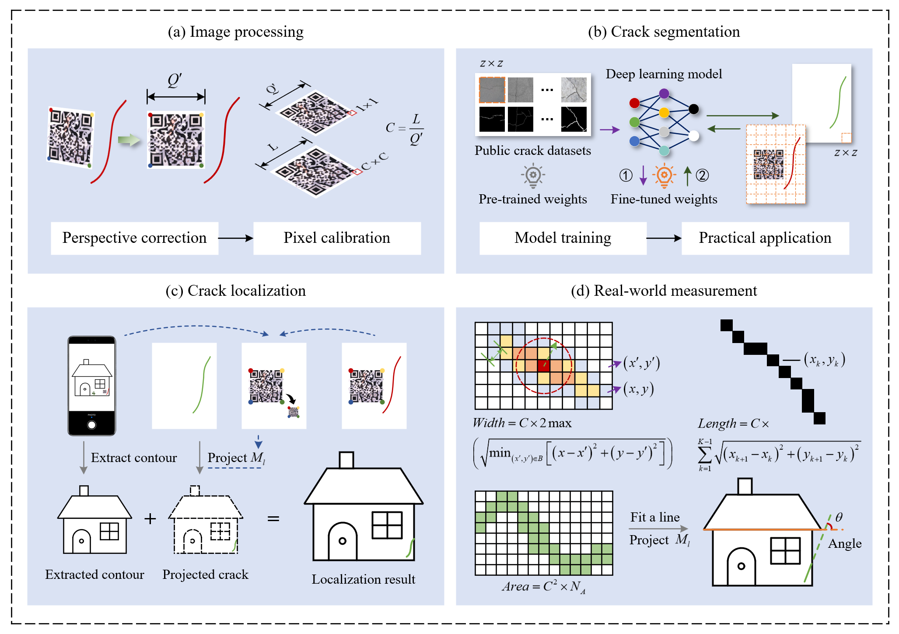

# Multi-scale Crack Localization and Measurement
This is the official repository for the paper [Multi-scale crack localization and measurement through crowdsourced image analysis for housing safety surveys](https://doi.org/10.1016/j.engstruct.2026.122372), published in **Engineering structures**.  
## Features

- **Perspective Correction**: Rectifies distorted images using detected QR codes or four user-defined coordinate points to ensure geometric accuracy.

- **Pixel-to-Real-World Mapping**: Converts pixel measurements into physical units based on reference markers.

- **Pixel-level Segmentation**: Performs patch-wise inference using SegFormer, followed by seamless stitching to handle high-resolution images. Training code: https://github.com/Li-Hubing/CrackSegFormer.git

- **Multi-scale Registration**: Establishes spatial correspondence between multi-scale images via QR codes, enabling precise localization of fine cracks at the structural component level.

- **Comprehensive Metrics**: Automatically calculates crack parameters, including width, length, area, and angle.

- **Interactive GUI**: Built-in graphical interface for manual two-point distance measurement.

<div align="center">
  
</div>

<p align="center">
  <strong>Fig. 1.</strong> Technical Framework.
</p>


## Installation
Clone the repository and install dependencies:
```
git clone https://github.com/Li-Hubing/CrackQR-ImageAnalysis.git
cd CrackQR-ImageAnalysis

conda create -n crackqr python=3.10
conda activate crackqr

pip install -r requirements.txt
```

## Usage

Run with:
```
python main.py
```

## Citation
If you find this repository helpful, please consider citing our paper.
